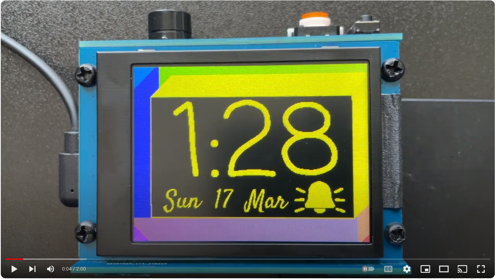
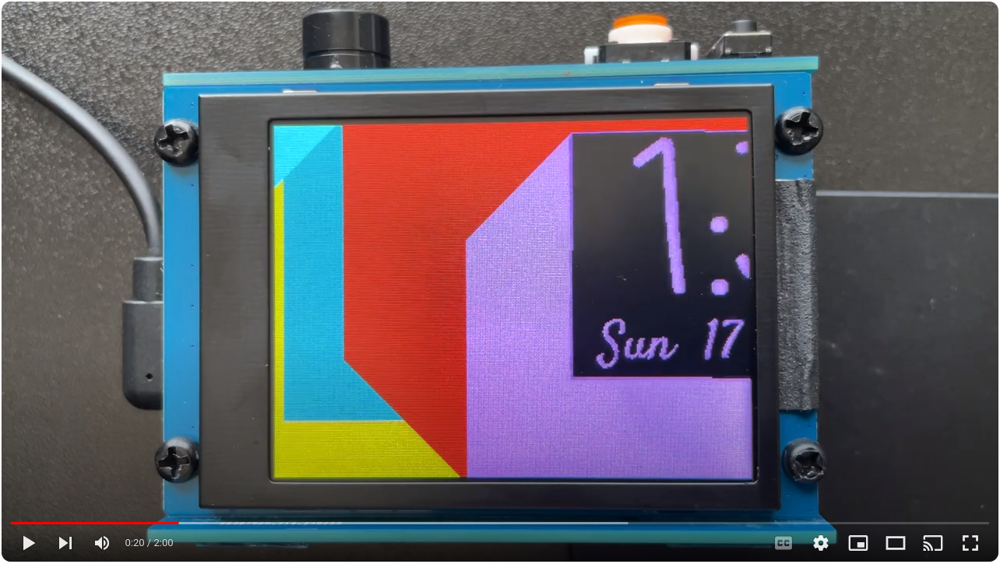
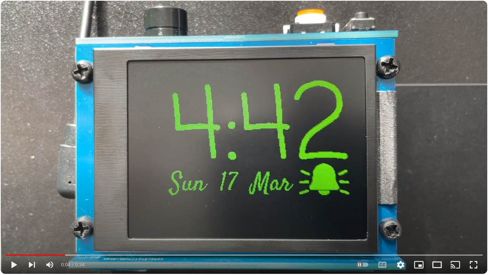
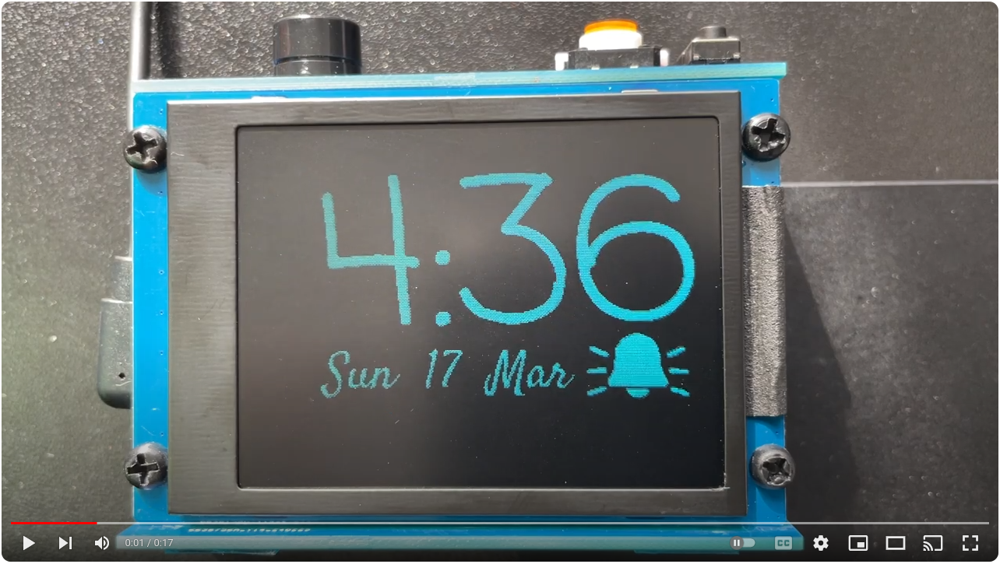

# Long Press Alarm Clock

When alarm time hits, program requires user to press and hold the main LED push button for 20 (adjustable) seconds continously to turn off the alarm, making sure the user wakes up.
Without the button press, buzzer keeps buzzing. If user lets go of the push button before alarm end time, the buzzer restarts. Max buzzer time of 120 seconds.

NOTE: Works with esp32 Board Manager version 2.0.15 only.

### Along with Super fast 50 FPS & Low RAM usage 16-bit RGB565 SPI frame transfer:
Upto 50 fps! for 40% sized frames and 20fps for full frames (320x240px), in just 9.6kB RAM usage with constraint of only 2 colors per frame.
Bounce: (Video. Open in new tab)

Fly In & Out:

Github: https://github.com/pk17r/Long_Press_Alarm_Clock/tree/release

- Software:
  - A fast very low RAM usage FastDrawTwoColorBitmapSpi display function is implemented that converts a full or section of a monochrome frame into 16-bit RGB565 frame with 2 colors 
  and sends data to display via SPI row by row in under 50ms for a full 320x240px frame and in only 20ms for 40% sized frame. This achieves a FPS of 20 frames per second for a
  full frame and a whooping 50 frames per second for 40% sized frames. Using this way of converting a monochrome image into 2 colors row by row saves a lot of RAM on the MCU as now
  we don't have to populate the whole 16-bit RGB565 frame, but only a 1-bit monochrome frame. This way a 153kB RGB565 frame on a 320x240px display is reduced to just 9.6kB, allowing 
  usage of lower RAM MCUs and much faster processing times per frame. A 40% sized canvas of a 320x240px display is made within 7ms on a 240MHz esp32. The screensaver implemented on
  this device achieves a whooping 45-50 frames per second speeds. https://github.com/pk17r/Long_Press_Alarm_Clock/blob/release/rgb_display_screens.cpp#l21
  - C++ OOP Based Project
  - All modules fully distributed in independent classes and header files
  - Arduino setup and loop functions in .ino file
  - MCU Selection and Module selections in configuration.h file, pin definitions in pin_defs.h file
  - A common header containing pointers to objects of every module and global functions
  - Adafruit Library used for GFX functions
  - uRTCLib Library for DS1307/DS3231 updated with AM/PM mode and class size reduced by 3 bytes while adding additional functionality
  - Secure Web Over The Air Firmware Update Functionality
  - Watchdog keeps a check on the program and reboots MCU if it gets stuck
  - Modular programming that fits single core or dual core microcontrollers

- Hardware:
  - Microcontroller: ESP32 S3 (Default) or ESP32 S2 Mini or ESP32 WROOM
  - Display: 2.8" ST7789V display (Default), other selectable options: ST7735, ILI9341 and ILI9488
  - Touchscreen XPT2046 (not enabled by default)
  - DS1307/DS3231 RTC Clock IC
  - A push button with LED
  - 2 push buttons for increase and decrease functions
  - An 85dB passive buzzer for alarm and different frequency tones

- Salient Features
  - There is no alarm snooze button.
  - Time update via NTP server using WiFi once every day to maintain high accuracy
  - DS1307/DS3231 RTC itself is high accuracy clock having deviation of +/-2 minutes per year
  - Time auto adjusts for time zone and day light savings with location ZIP/PIN and country code
  - Get Weather info using WiFi and display today's weather after alarm
  - Get user input of WiFi details via an on-screen keyboard (when touchscreen is used and enabled)
  - Colorful Smooth Screensaver with a big clock
  - Touchscreen based alarm set page (touchscreen not on by default)
  - Settings saved in ESP32 NVM so not lost on power loss
  - Screen brightness changes according to time of the day, with lowest brightness setting at night time
  - Time critical tasks happen on core0 - time update, screensaver fast motion, alarm time trigger
  - Non Time critical tasks happen on core1 - update weather info using WiFi, update time using NTP server, connect/disconnect WiFi
  - Very Low Power usage of 0.5W during day and 0.3W during night time

- Datasheets:
  - ESP32 Lolin S2 Mini Single Core MCU Board https://www.wemos.cc/en/latest/s2/s2_mini.html
  - ESP32 Lolin S2 Mini Pinouts https://www.studiopieters.nl/wp-content/uploads/2022/08/WEMOS-ESP32-S2-MINI.png
  - 2.8" Touchscreen ST7789V driver https://www.aliexpress.us/item/3256805747165796.html
  - 2.8" Touchscreen ILI9341 driver http://www.lcdwiki.com/2.8inch_SPI_Module_ILI9341_SKU:MSP2807
 

Prashant Kumar

 
 

Bounce with Black Background:

Fly In & Out with Black Background:
